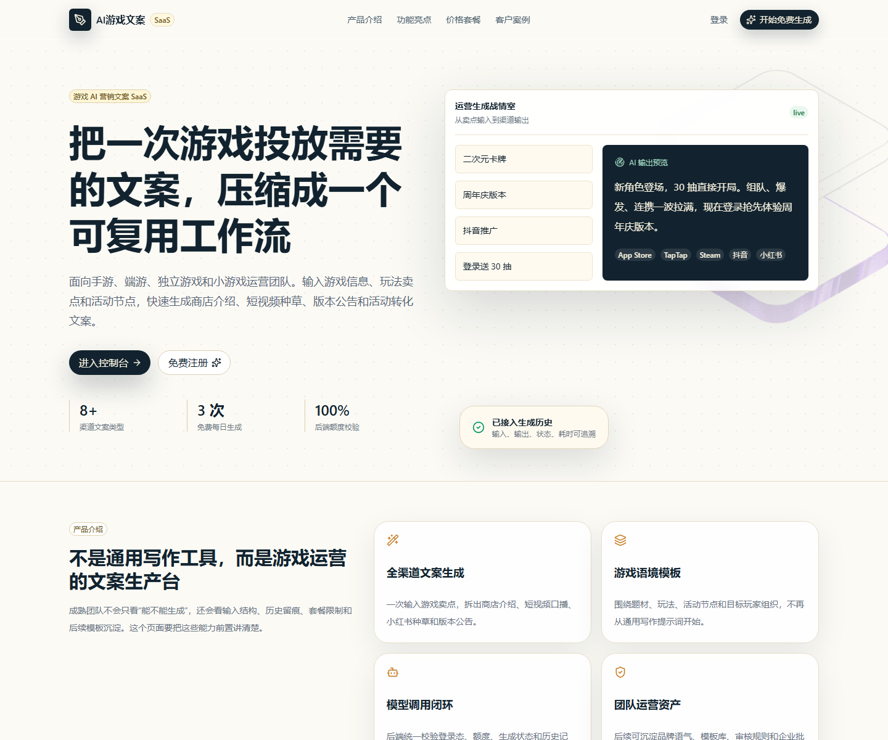
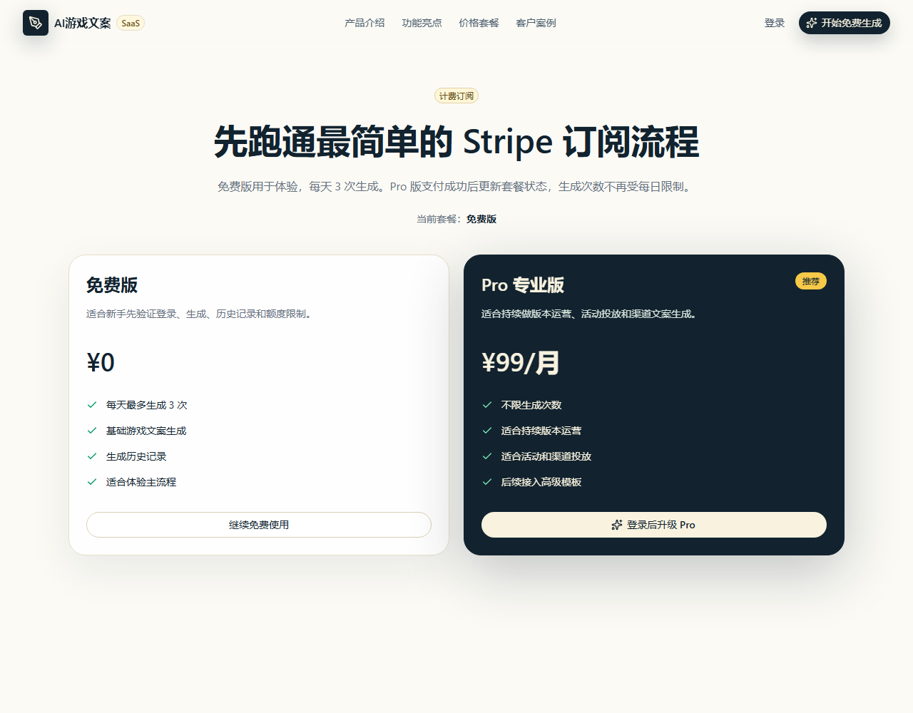
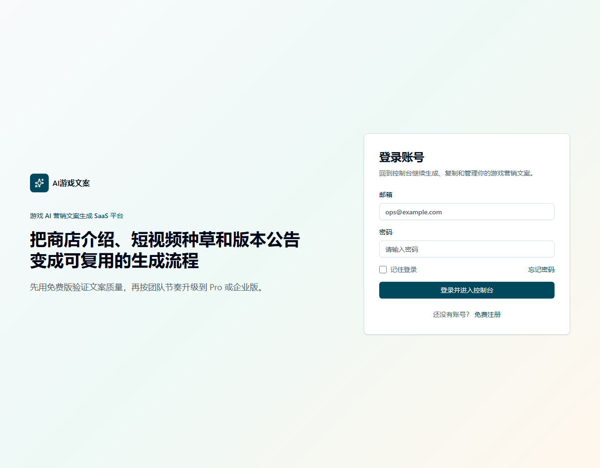

# AI 游戏文案 SaaS

一个面向游戏运营团队的 AI 营销文案生成 SaaS 练习项目。项目从落地页、注册登录、AI 生成、历史记录、免费额度、Stripe 订阅、Admin 后台到 Supabase 数据持久化，跑通了一个小型 SaaS 的核心闭环。

## 产品定位

游戏运营经常需要为商店页、短视频、社区、版本公告和活动投放反复写文案。这个项目的目标是把“输入游戏信息 -> 生成多渠道文案 -> 保存历史 -> 付费解锁更多生成次数”做成一个完整工作台。

目标用户：

- 手游、端游、独立游戏、小游戏运营
- 小型发行团队和内容投放团队
- 想快速验证 AI 文案 SaaS 流程的产品/前端练习者

## 核心功能

- **官网落地页**：展示产品价值、功能亮点、价格套餐和案例。
- **注册 / 登录**：使用 Supabase Auth 完成账号体系。
- **用户控制台**：填写游戏信息，调用后端 AI 接口生成中文营销文案。
- **生成历史**：保存输入、输出、模型、状态、耗时和 token 用量。
- **免费额度限制**：免费用户每天最多生成 3 次。
- **Pro 订阅**：Stripe Checkout 支付成功后升级为 Pro。
- **权益同步**：Stripe Webhook 写入 `subscriptions`，并更新 `profiles.plan/payment_status`。
- **Admin 后台**：管理员查看用户、生成记录、订阅状态和详情。

## 页面截图

### 落地页



### 计费页



### 登录页



## 技术栈

| 模块 | 技术 |
| --- | --- |
| 前端框架 | Vite + React 19 + TypeScript |
| 路由 | React Router |
| UI | Tailwind CSS v4、HeroUI、shadcn/ui 风格组件 |
| 图标 | lucide-react |
| 后端 | Express + TypeScript + tsx |
| 认证与数据库 | Supabase Auth + Postgres + RLS |
| AI 生成 | OpenAI SDK，支持自定义 `OPENAI_BASE_URL` |
| 支付 | Stripe Checkout + Stripe Webhook |
| 验证 | ESLint、TypeScript build、Node test |

## 核心流程

### 1. 注册登录

1. 用户访问 `/register` 注册账号。
2. Supabase Auth 创建用户。
3. 数据库触发器在 `profiles` 表创建用户资料。
4. 登录后进入 `/dashboard`。

### 2. AI 文案生成

1. 前端从 Supabase session 取 access token。
2. `/dashboard` 提交游戏信息到后端 `/api/generate`。
3. 后端验证 token，确认用户身份。
4. 后端读取 `profiles.plan/payment_status` 和当天成功生成次数。
5. 免费用户超过每日限制时返回 403。
6. 未超限或 Pro 用户调用模型生成文案。
7. 后端把生成记录写入 `generations` 表。
8. 前端展示结果并刷新历史记录。

### 3. Stripe 订阅

1. 用户在 `/billing` 点击升级 Pro。
2. 前端请求 `/api/billing/create-checkout-session`。
3. 后端创建 Stripe Checkout Session，并把 `user_id` 写入 metadata。
4. 用户跳转到 Stripe Checkout 完成测试支付。
5. Stripe Webhook 回调 `/api/stripe/webhook`。
6. 后端校验 webhook 签名，写入 `subscriptions` 表。
7. 后端同步更新 `profiles.plan = pro`、`profiles.payment_status = active`。
8. Pro 用户再次生成时不受每日 3 次限制。

### 4. Admin 后台

1. `/admin` 由前端路由守卫检查登录和 `profile.role`。
2. Admin 数据通过 `/api/admin/overview` 获取。
3. 后端使用 service role 查询全量用户、生成记录和订阅数据。
4. 普通用户无法访问 Admin API。

## 本地运行

### 1. 安装依赖

```bash
npm install
```

### 2. 创建环境变量

复制 `.env.example` 为 `.env.local`：

```bash
cp .env.example .env.local
```

Windows PowerShell：

```powershell
Copy-Item .env.example .env.local
```

需要填写：

```bash
VITE_SUPABASE_URL=your-supabase-project-url
VITE_SUPABASE_PUBLISHABLE_KEY=your-supabase-publishable-key
SUPABASE_SERVICE_ROLE_KEY=your-supabase-service-role-key

OPENAI_API_KEY=your-model-api-key
OPENAI_BASE_URL=https://api.andanzhiguang.uk/v1
OPENAI_MODEL=gpt-5.5

FREE_DAILY_GENERATION_LIMIT=3
APP_URL=http://127.0.0.1:5173

STRIPE_SECRET_KEY=sk_test_xxx
STRIPE_PRO_PRICE_ID=price_xxx
STRIPE_WEBHOOK_SECRET=whsec_xxx
```

不要提交 `.env.local`。

### 3. 初始化 Supabase SQL

在 Supabase Dashboard / SQL Editor 依次执行：

```txt
supabase/profiles.sql
supabase/generations.sql
supabase/admin-dashboard.sql
supabase/subscriptions.sql
```

### 4. 启动项目

同时启动前端和本地 API：

```bash
npm run dev
```

如果 Windows 下并发启动不稳定，可以分开启动：

```bash
npm run dev:web -- --host 127.0.0.1
npm run dev:api
```

访问：

```txt
http://127.0.0.1:5173
```

### 5. Stripe 本地 Webhook

安装并登录 Stripe CLI 后运行：

```bash
stripe listen --forward-to localhost:5174/api/stripe/webhook
```

把输出的 `whsec_xxx` 填到 `.env.local` 的 `STRIPE_WEBHOOK_SECRET`。

测试卡：

```txt
4242 4242 4242 4242
任意未来有效期
任意 CVC
```

## 常用验证命令

```bash
node --test server/admin-auth.test.ts server/billing-rules.test.ts
npm run lint
npm run build
```

## 数据表说明

| 表 | 作用 |
| --- | --- |
| `profiles` | 用户资料、角色、套餐、支付状态 |
| `generations` | AI 生成历史、状态、耗时、token 用量 |
| `subscriptions` | Stripe 订阅记录、价格 ID、订阅状态和周期 |

## 项目状态

这个项目适合作为全栈 SaaS 练习和作品集展示。它已经覆盖“注册 -> 使用 -> 付费 -> 权益生效 -> 后台查看”的主链路。

如果要继续向生产环境推进，下一步建议补：

- 订阅状态展示和手动刷新支付状态
- Stripe Customer Portal 取消订阅
- 模板库 MVP
- 数据看板
- API 限流和错误日志
- 路由懒加载和包体积优化

## 项目复盘

详细复盘见：[docs/project-retrospective.md](docs/project-retrospective.md)
